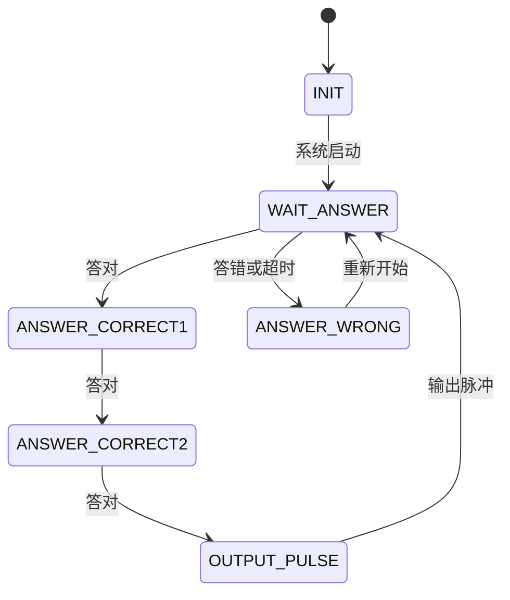

```mermaid
stateDiagram
    [*] --> INIT
    
    INIT --> WAIT_ANSWER: 系统启动
    WAIT_ANSWER --> ANSWER_CORRECT1: 答对
    WAIT_ANSWER --> ANSWER_WRONG: 答错或超时
    ANSWER_CORRECT1 --> ANSWER_CORRECT2: 答对
    ANSWER_CORRECT2 --> OUTPUT_PULSE: 答对
    ANSWER_WRONG --> WAIT_ANSWER: 重新开始
    OUTPUT_PULSE --> WAIT_ANSWER: 输出脉冲

            
```