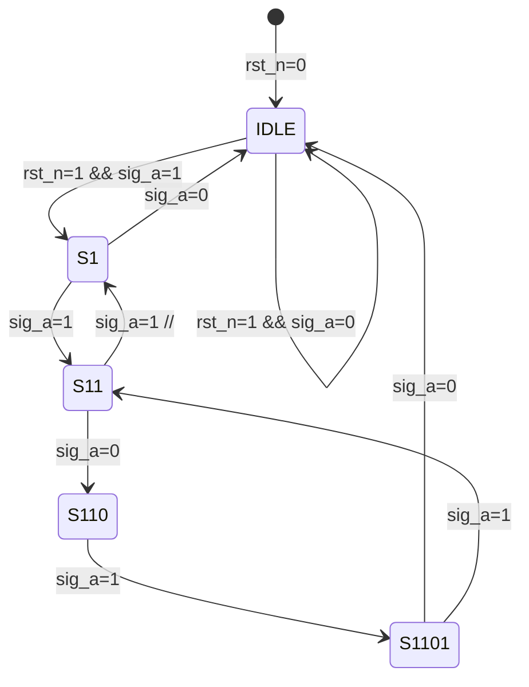

```mermaid
stateDiagram
    [*] --> IDLE : rst_n=0
    IDLE --> S1 : rst_n=1 && sig_a=1
    IDLE --> IDLE : rst_n=1 && sig_a=0

    S1 --> S11 : sig_a=1
    S1 --> IDLE : sig_a=0

    S11 --> S110 : sig_a=0
    S11 --> S1 : sig_a=1  // 

    S110 --> S1101 : sig_a=1
    S1101 --> IDLE : sig_a=0
    S1101 --> S11 : sig_a=1
```